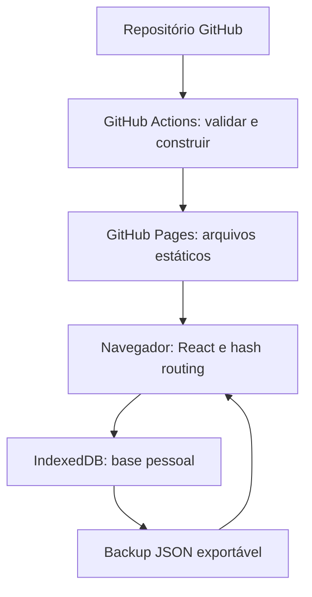
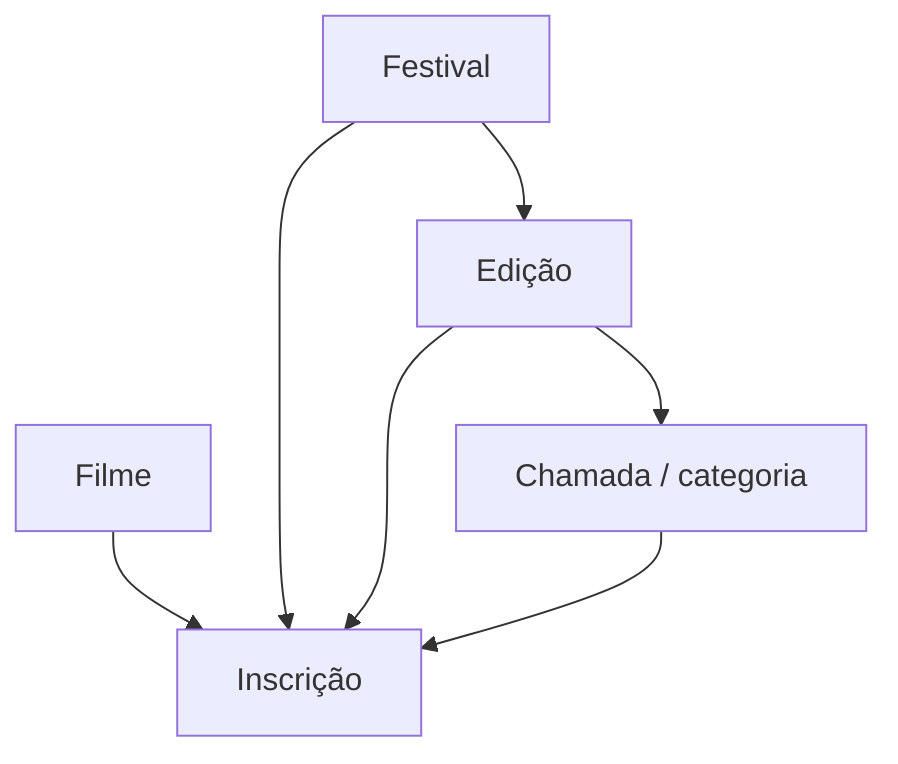

# Arquitetura do Circuito

Circuito é uma SPA/PWA estática para um repositório convencional e GitHub Pages. A publicação entrega somente HTML, CSS, JavaScript, JSON público, ícones e service worker. Não existe processo Node em produção nem dependência de APIs de ChatGPT.

O catálogo é um asset local do build. A primeira abertura carrega-o na base; uma atualização de catálogo adiciona entidades ausentes sem sobrescrever mudanças locais com o mesmo ID. A origem da hospedagem recebe pedidos dos arquivos públicos, nunca um POST com a base pessoal. O aplicativo não executa scraping, analytics nem sincronização automática.

## Modelo de entidades

Cada festival guarda a identidade. Cada edição guarda o período e a procedência anual. Cada chamada guarda regras próprias, prazos e taxas. Uma inscrição referencia as quatro entidades; a validação recusa uma chamada de outra edição ou uma edição de outro festival. IDs são estáveis e independentes do nome; novas entidades usam UUID.

## Persistência e concorrência

`repository.ts` concentra IndexedDB, com stores separadas para as cinco entidades e metadados. O provider serializa mudanças, recarrega a base mais recente antes de alterá-la e usa Web Locks quando disponível para coordenar abas da mesma origem. BroadcastChannel avisa outras abas para recarregar após uma gravação. Sem Web Locks, a fila ainda protege a aba atual; edições simultâneas em abas diferentes podem competir. Evite editar o mesmo registro em duas abas ao mesmo tempo.

A substituição validada usa uma única transação read/write sobre todas as stores. Mesmo uma falha síncrona ao clonar um valor aborta a transação e conserva o conteúdo anterior. O upgrade físico cria stores e índices sem remover dados. O schema de conteúdo passa pelo mesmo importador ao carregar e restaurar.

## Routing e hospedagem

O hash guarda a tela, como `#/filmes/id`. O caminho HTTP permanece na pasta publicada, o que permite refresh e links diretos no Pages sem fallback de servidor. Vite recebe `VITE_BASE_PATH`; o workflow calcula `/NOME-DO-REPOSITORIO/` ou `/` para a página principal da conta. Manifest, ícones, service worker e precache usam esse mesmo valor.

## PWA

O script de build gera uma lista dos assets e uma versão derivada do conteúdo. O service worker guarda apenas GETs locais da pasta da aplicação. Navegação tenta rede e usa o HTML em cache quando offline; assets conhecidos usam cache. Uma atualização fica aguardando até o usuário aplicá-la. A limpeza de caches se limita ao prefixo do Circuito; não abre nem apaga IndexedDB. O aplicativo avisa sobre atualizações e impede aplicá-las enquanto há um formulário aberto.

## Regras, busca e escala

Datas são ISO sem converter datas civis pelo fuso do sistema. Horários de prazo usam o fuso declarado na etapa; status são calculados a cada consulta. A próxima etapa indica urgência e taxa vigente; o último prazo válido indica o encerramento completo. Abertura isolada não é um prazo final. Dados antigos ou não confirmados não geram inscrição aberta automaticamente.

Os filtros indexam festival, edição e chamadas e comparam todos os critérios à mesma chamada da edição mais recente. Paginação reduz DOM e o catálogo é um asset separado, em vez de aumentar o JavaScript inicial. A busca global inclui aliases, categorias e notas locais. Elegibilidade lista verificações, conflitos e lacunas; informações de estreia sem histórico suficiente continuam exigindo conferência.

## Extensões futuras

Uma sincronização opcional pode consumir a interface do repositório e o schema de backup, sem espalhar código de rede nas telas. Ela exigiria uma implementação e autorização próprias; a versão atual não contém autenticação, tokens nem gravação de dados pessoais no GitHub.
